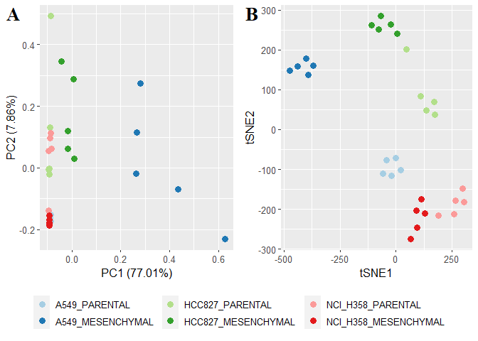
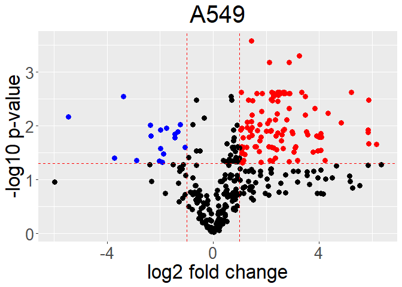
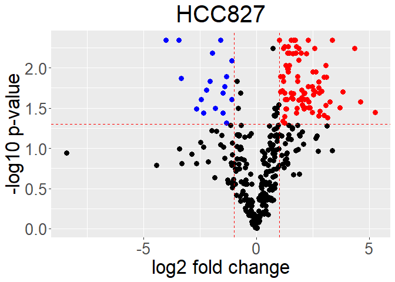
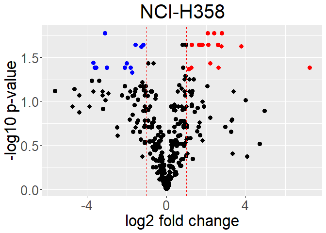
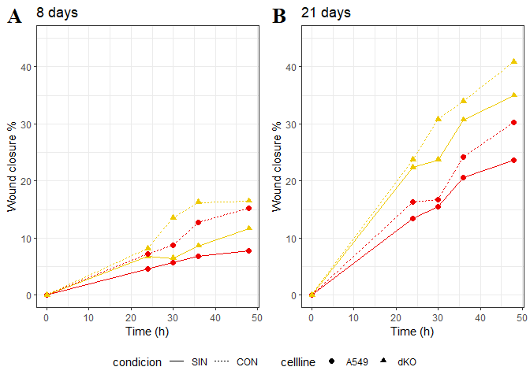

Metabolomic analysis
================
Meztli Matadamas
20/10/2020

# Epithelial to Mesenchymal transition

Epithelial-to-mesenchymal transition (EMT) relates to many molecular and
cellular alterations that occur when epithelial cells undergo a switch
in differentiation generating mesenchymal-like cells with newly acquired
migratory and invasive properties. In cancer cells, EMT leads to drug
resistance and metastasis. Moreover, differences in genetic backgrounds,
even between patients with the same type of cancer, also determine
resistance to some treatments. Metabolic rewiring is essential to induce
EMT, hence it is important to identify key metabolic elements for this
process, which can be later used to treat cancer cells with different
genetic backgrounds.

This protocol analyze Metabolomic data from [Sun Y., *et. al.*
2014](https://doi.org/10.1186/2049-3002-2-20) to infer reactions
changing after EMT induction with TGF-\(\beta\).

The dataset contains data from three non-small cell lung cancer cell
lines: **A549, HCC827 and NCI-H358**

These cell lines have different genetic backgrounds, hence we aimed to
identify the metabolic similarities among them. A549 and NCI-H358 have
mutations in KRAS, while HCC827 has mutations in EGFR. To find key EMT
features, we compared the three cell lines data and found their
similarities.

# Reading the data

``` r
EMT <- vroom::vroom("input/Metabolomica_antes-despues_EMT.txt")

EMT <- janitor::clean_names(dat = EMT, 
                            case = "screaming_snake")
EMT<- EMT %>% filter(!is.na(BIOCHEMICAL))
EMT
```

    ## # A tibble: 683 x 40
    ##    BIOCHEMICAL SUPER_PATHWAY SUB_PATHWAY PLATFORM    RI  MASS CAS   PUBCHEM
    ##    <chr>       <chr>         <chr>       <chr>    <dbl> <dbl> <chr>   <dbl>
    ##  1 1,2-dipalm~ Lipid         Diacylglyc~ GC/MS    2638.  313. 4029~  9.99e4
    ##  2 dihydroxya~ Carbohydrate  Glycolysis~ GC/MS    1263   103  6214~  6.70e2
    ##  3 1,3-dipalm~ Lipid         Diacylglyc~ GC/MS    2637   371. <NA>   6.81e4
    ##  4 1-arachido~ Lipid         Lysolipid   LC/MS N~ 5731   500. <NA>  NA     
    ##  5 1-docosahe~ Lipid         Lysolipid   LC/MS P~ 5518   568. <NA>  NA     
    ##  6 1-docosape~ Lipid         Lysolipid   LC/MS P~ 5584   570. <NA>  NA     
    ##  7 1-heptadec~ Lipid         Lysolipid   LC/MS P~ 5750   510. 5093~ NA     
    ##  8 1-linoleoy~ Lipid         Lysolipid   LC/MS P~ 5574   520. <NA>   1.20e7
    ##  9 1-methylni~ Cofactors an~ Nicotinate~ LC/MS P~  688   137. 1005~ NA     
    ## 10 1-myristoy~ Lipid         Lysolipid   LC/MS P~ 5481   468. 2055~  4.61e5
    ## # ... with 673 more rows, and 32 more variables: KEGG <chr>, HMDB <chr>,
    ## #   A549_PARENTAL_1 <dbl>, A549_PARENTAL_2 <dbl>, A549_PARENTAL_3 <dbl>,
    ## #   A549_PARENTAL_4 <dbl>, A549_PARENTAL_5 <dbl>, A549_MESENCHYMAL_1 <dbl>,
    ## #   A549_MESENCHYMAL_2 <dbl>, A549_MESENCHYMAL_3 <dbl>,
    ## #   A549_MESENCHYMAL_4 <dbl>, A549_MESENCHYMAL_5 <dbl>,
    ## #   HCC827_PARENTAL_1 <dbl>, HCC827_PARENTAL_2 <dbl>, HCC827_PARENTAL_3 <dbl>,
    ## #   HCC827_PARENTAL_4 <dbl>, HCC827_PARENTAL_5 <dbl>,
    ## #   HCC827_MESENCHYMAL_1 <dbl>, HCC827_MESENCHYMAL_2 <dbl>,
    ## #   HCC827_MESENCHYMAL_3 <dbl>, HCC827_MESENCHYMAL_4 <dbl>,
    ## #   HCC827_MESENCHYMAL_5 <dbl>, NCI_H358_PARENTAL_1 <dbl>,
    ## #   NCI_H358_PARENTAL_2 <dbl>, NCI_H358_PARENTAL_3 <dbl>,
    ## #   NCI_H358_PARENTAL_4 <dbl>, NCI_H358_PARENTAL_5 <dbl>,
    ## #   NCI_H358_MESENCHYMAL_1 <dbl>, NCI_H358_MESENCHYMAL_2 <dbl>,
    ## #   NCI_H358_MESENCHYMAL_3 <dbl>, NCI_H358_MESENCHYMAL_4 <dbl>,
    ## #   NCI_H358_MESENCHYMAL_5 <dbl>

# PCA and tSNE generation

In order to explore the data we performed two dimentional reduction
algorithms: PCA and tSNE.

``` r
PCAMatrix<-EMT %>% 
  select(contains(c("A549","HCC","NCI"))) %>% drop_na()

pca = prcomp(t(PCAMatrix))
nametable<-as.data.frame(cbind(colnames(PCAMatrix),gsub("\\_[1-9]","",colnames(PCAMatrix))))
nametable$V2<-as.factor(nametable$V2)
nametable$V2<-factor(nametable$V2,levels = levels(nametable$V2)[c(2,1,4,3,6,5)])

library(ggfortify)
aplot<-autoplot(pca,data=nametable,colour='V2',frame=F,size=3)+
  scale_color_brewer(palette = "Paired")+
  theme(text = element_text(size=12),legend.position="bottom",legend.title = element_blank())
```

    ## Warning: `select_()` is deprecated as of dplyr 0.7.0.
    ## Please use `select()` instead.
    ## This warning is displayed once every 8 hours.
    ## Call `lifecycle::last_warnings()` to see where this warning was generated.

``` r
set.seed(80)
results=Rtsne(t(PCAMatrix),dims=2,perplexity=5,verbose=F,max_iter=10000)
# plotting
bplot<-ggplot(as.data.frame(results$Y),aes(x=results$Y[,1],y=results$Y[,2],col=nametable$V2))+
  xlab("tSNE1") + ylab("tSNE2")+
  geom_point(size=3)+ #Size and alpha just for fun
  scale_color_brewer(palette = "Paired")+ #your colors here
  theme(text = element_text(size=12),legend.position="bottom",legend.title = element_blank())

prow<-cowplot::plot_grid(
  aplot+ theme(legend.position="none"),
  bplot+ theme(legend.position="none"),
  labels = "AUTO",label_size = 20,label_fontfamily = "serif")

legend_b <- get_legend(
  aplot 
)

cowplot::plot_grid(prow, legend_b, ncol = 1, rel_heights = c(1, .2))
```

<!-- -->

As we observed PCA do not show clear groups among the data. tSNE shows
that cell lines are different between each other however, each cell line
has a clear difference between parental and mesenchymal samples.
Parental corresponds to cell lines prior to EMT induction, while
Mesenchymal corresponds to cell lines after EMT induction.

# Differential analysis

We calculated the log-fold change and identified the metabolites that
significantly changed their concentration before and after EMT
induction, for each cell line. As we need to do it for each cell line
contained in the table we developed a function to calculate *p*-value
and foldchange, returning a tribble with the data to graph the results.

``` r
#only known metabolites have an assigned pathway
##data= data, y=cell line
diffmet<-function(data,y){
  
  f<-data %>% 
    filter(!is.na(SUPER_PATHWAY)) %>% 
    select(contains(y),BIOCHEMICAL) %>% 
    pivot_longer(cols=-c("BIOCHEMICAL"),names_to = "muestra") %>% 
    mutate(condicion=case_when(grepl("PARENTAL", muestra) ~ "Parental",
                               grepl("MESENCHYMAL",muestra) ~ "Mesenchymal" )) %>% 
    select(-muestra) %>% 
    group_by(BIOCHEMICAL,condicion) %>% 
    summarise(meanMet = mean(value)) %>% #group_by(BIOCHEMICAL) %>% 
    summarise(foldchange = log2(first(meanMet)/last(meanMet) ) ) ###meanMet[1]/meanMet[2]
  
  
  p<-data %>% 
    filter(!is.na(SUPER_PATHWAY)) %>% 
    select(contains(y),BIOCHEMICAL) %>% 
    group_by(BIOCHEMICAL) %>% 
    pivot_longer(cols=-c("BIOCHEMICAL"),names_to = "muestra") %>% 
    mutate(condicion=case_when(grepl("PARENTAL", muestra) ~ "Parental",
                               grepl("MESENCHYMAL",muestra) ~ "Mesenchymal" )) %>% 
    select(-muestra) %>% 
    t_test(value ~ condicion, data = .,paired=T ) %>% 
    adjust_pvalue(method = "fdr") %>%
    add_significance("p.adj") #%>% group_by(p.adj.signif) %>% count()
  
  
  z<-left_join(f,p) %>% mutate(threshold=case_when(
    foldchange > 1 & p.adj<.05 ~ 1, 
    foldchange < -1 & p.adj<.05 ~ 2,
    TRUE ~ 0))%>% 
    mutate(label=case_when(
      threshold>0 ~ BIOCHEMICAL, 
      TRUE ~ "")) %>%
    select(BIOCHEMICAL,foldchange,p.adj,p.adj.signif,threshold,label) %>% 
    mutate(across(threshold,as.factor))
  
  return(z)
}
```

## A549

``` r
A549<-diffmet(EMT,"A549")

ggplot(A549,aes(x=foldchange, y=-log10(p.adj), colour=threshold)) +
  geom_point(size=3) +
  ggtitle(label = "A549")+
  xlab("log2 fold change") + 
  ylab("-log10 p-value") +
  theme(text = element_text(size=25),legend.position="none",
        plot.title = element_text(hjust = 0.5))+
  scale_color_manual(values=c("black", "red", "blue"))+
  geom_hline(yintercept = -log(0.05,10), linetype = "dashed",color="red") +
  geom_vline(xintercept = c(-1, 1), linetype = "dashed",color="red") 
```

<!-- -->

``` r
#get list of metabolites differentially present
subset(A549, p.adj<.05 & abs(foldchange)>1.5)[,1]
```

    ## # A tibble: 99 x 1
    ##    BIOCHEMICAL                   
    ##    <chr>                         
    ##  1 1-arachidonoyl-GPE* (20:4)*   
    ##  2 2'-AMP                        
    ##  3 2'-deoxyguanosine             
    ##  4 2-eicosatrienoyl-GPC* (20:3)* 
    ##  5 2-hydroxyadipate              
    ##  6 2-hydroxypalmitate            
    ##  7 2-hydroxystearate             
    ##  8 2-linoleoyl-GPC* (18:2)*      
    ##  9 2-methylbutyroylcarnitine (C5)
    ## 10 2-myristoyl-GPC* (14:0)*      
    ## # ... with 89 more rows

## HCC827

``` r
HCC827<-diffmet(EMT,"HCC")

ggplot(HCC827,aes(x=foldchange, y=-log10(p.adj), colour=threshold)) +
  geom_point(size=3) +
  ggtitle(label = "HCC827")+
  xlab("log2 fold change") + 
  ylab("-log10 p-value") +
  theme(text = element_text(size=25),legend.position="none",
        plot.title = element_text(hjust = 0.5))+
  scale_color_manual(values=c("black", "red", "blue"))+
  geom_hline(yintercept = -log(0.05,10), linetype = "dashed",color="red") +
  geom_vline(xintercept = c(-1, 1), linetype = "dashed",color="red") 
```

<!-- -->

``` r
#get list of metabolites differentially present
subset(HCC827, p.adj<.05 & abs(foldchange)>1.5)[,1]
```

    ## # A tibble: 77 x 1
    ##    BIOCHEMICAL                              
    ##    <chr>                                    
    ##  1 1-methyladenosine                        
    ##  2 1-palmitoyl-GPE (16:0)                   
    ##  3 10-heptadecenoate (17:1n7)               
    ##  4 2-hydroxyadipate                         
    ##  5 2-hydroxyglutarate                       
    ##  6 2-methylbutyroylcarnitine (C5)           
    ##  7 3-phosphoserine                          
    ##  8 5-methyltetrahydrofolate (5MeTHF)        
    ##  9 acetylcarnitine (C2)                     
    ## 10 adenosine 5'-diphosphoribose (ADP-ribose)
    ## # ... with 67 more rows

## NCI-H358

``` r
H358<-diffmet(EMT,"NCI")

ggplot(H358,aes(x=foldchange, y=-log10(p.adj), colour=threshold)) +
  geom_point(size=3) +
  ggtitle(label = "NCI-H358")+
  xlab("log2 fold change") + 
  ylab("-log10 p-value") +
  theme(text = element_text(size=25),legend.position="none",
        plot.title = element_text(hjust = 0.5))+
  scale_color_manual(values=c("black", "red", "blue"))+
  geom_hline(yintercept = -log(0.05,10), linetype = "dashed",color="red") +
  geom_vline(xintercept = c(-1, 1), linetype = "dashed",color="red") 
```

<!-- -->

``` r
#get list of metabolites differentially present
subset(H358, p.adj<.05 & abs(foldchange)>1.5)[,1]
```

    ## # A tibble: 24 x 1
    ##    BIOCHEMICAL                   
    ##    <chr>                         
    ##  1 1-palmitoyl-GPI* (16:0)*      
    ##  2 1-stearoyl-GPI (18:0)         
    ##  3 2'-deoxyinosine               
    ##  4 acetyl-CoA                    
    ##  5 C-glycosyltryptophan*         
    ##  6 CDP-choline                   
    ##  7 citrulline                    
    ##  8 CMP                           
    ##  9 cysteine-glutathione disulfide
    ## 10 glycerol 2-phosphate          
    ## # ... with 14 more rows

Let´s calculate how many metabolites change in common between cell
lines. We represented this on a Venn diagram.

    ##                                   A549 HCC827 NCI358
    ## glycerol 3-phosphate (G3P)           1      1      1
    ## glycerophosphorylcholine (GPC)       1      1      1
    ## glycyltyrosine                       1      1      1
    ## N-acetylglucosamine 6-phosphate      1      1      1
    ## nicotinamide ribonucleotide (NMN)    1      1      1
    ## tryptophan                           1      1      1


Venn Diagram for Enrichment pathway results from
[https://www.metaboanalyst.ca/](Metaboanalyst%204.0):

``` r
#setwd("../Dropbox/inmegen/EMT/MSEA2/")

A549<-read.csv("input/EnrichmentA549.csv")
HCC<-read.csv("input/EnrichmentHCC827.csv")
NCI<-read.csv("input/EnrichmentNCIH358.csv")


as.character(A549[which(A549$Holm.p<.01),1])->a
as.character(HCC[which(HCC$Holm.p<.01),1])->b
as.character(NCI[which(NCI$Holm.p<.01),1])->c

length(sort(unique(c(a,b,c))))
```

    ## [1] 95

``` r
Matrix<-matrix(0,nrow=length(A549$X),ncol=3)
rownames(Matrix)<-A549$X
colnames(Matrix)<-c("A549","HCC827","NCI358")

Matrix[which(rownames(Matrix) %in% a),1]<-1
Matrix[which(rownames(Matrix) %in% b),2]<-1
Matrix[which(rownames(Matrix) %in% c),3]<-1

library("limma")
vennCounts(Matrix)->conteo

as.data.frame(Matrix)->Todo
Todo[which(Todo$A549==1&Todo$HCC827==1&Todo$NCI358==1),]
```

    ##                                                                    A549 HCC827
    ## Valine, Leucine and Isoleucine Degradation                            1      1
    ## Glycine and Serine Metabolism                                         1      1
    ## Citric Acid Cycle                                                     1      1
    ## Beta-Alanine Metabolism                                               1      1
    ## Glutamate Metabolism                                                  1      1
    ## Lysine Degradation                                                    1      1
    ## Tryptophan Metabolism                                                 1      1
    ## Retinol Metabolism                                                    1      1
    ## Ethanol Degradation                                                   1      1
    ## Pyruvate Metabolism                                                   1      1
    ## Nicotinate and Nicotinamide Metabolism                                1      1
    ## Fatty acid Metabolism                                                 1      1
    ## Beta Oxidation of Very Long Chain Fatty Acids                         1      1
    ## Mitochondrial Beta-Oxidation of Medium Chain Saturated Fatty Acids    1      1
    ## Mitochondrial Beta-Oxidation of Short Chain Saturated Fatty Acids     1      1
    ## Steroid Biosynthesis                                                  1      1
    ## Phytanic Acid Peroxisomal Oxidation                                   1      1
    ## Methionine Metabolism                                                 1      1
    ## Purine Metabolism                                                     1      1
    ## Glutathione Metabolism                                                1      1
    ## Folate Metabolism                                                     1      1
    ##                                                                    NCI358
    ## Valine, Leucine and Isoleucine Degradation                              1
    ## Glycine and Serine Metabolism                                           1
    ## Citric Acid Cycle                                                       1
    ## Beta-Alanine Metabolism                                                 1
    ## Glutamate Metabolism                                                    1
    ## Lysine Degradation                                                      1
    ## Tryptophan Metabolism                                                   1
    ## Retinol Metabolism                                                      1
    ## Ethanol Degradation                                                     1
    ## Pyruvate Metabolism                                                     1
    ## Nicotinate and Nicotinamide Metabolism                                  1
    ## Fatty acid Metabolism                                                   1
    ## Beta Oxidation of Very Long Chain Fatty Acids                           1
    ## Mitochondrial Beta-Oxidation of Medium Chain Saturated Fatty Acids      1
    ## Mitochondrial Beta-Oxidation of Short Chain Saturated Fatty Acids       1
    ## Steroid Biosynthesis                                                    1
    ## Phytanic Acid Peroxisomal Oxidation                                     1
    ## Methionine Metabolism                                                   1
    ## Purine Metabolism                                                       1
    ## Glutathione Metabolism                                                  1
    ## Folate Metabolism                                                       1

``` r
library(ggforce)
library(grid)
library(tidyverse)

df.venn <- data.frame(x = c(-1, 1, 0),
                      y = c(1, 1, -.7),
                      labels = colnames(Todo))
vdc <- conteo
class(vdc) <- 'matrix'
##positions on Venn Diagram
df.vdc <- as.data.frame(vdc) %>%
  mutate(x = c(2,0, 1.2, 0.7, -1.2, -0.7, 0, 0),
         y = c(-2,-1, 1.2, 0, 1.2, 0, 1.25, 0.4))

VE<-ggplot(df.venn) +
  geom_circle(aes(x0 = x, y0 = y, r = 1.5, fill = labels,color=labels), alpha = .5) +
  coord_fixed() +
  theme_void() +
  theme(legend.position = 'none') +
  labs(fill = NULL) +
  annotate("text", x = df.vdc$x, y = df.vdc$y, label = df.vdc$Counts)+
  geom_label(label=c("A549","HCC827","NCI-H358"),x=c(-1,1,0),y=c(2.8,2.8,-2.5),label.size = NA,alpha=0)+
  ylim(-2.5,3)

#ggsave("output/VennEnrich.png",width = 6,height=6,units = "cm")

path<-rownames(Todo[which(Todo$A549==1&Todo$HCC827==1&Todo$NCI358==1),])

pathcom<-data.frame(path=path,
                   x=length(path),y=length(path):1)
pathcom$path<-gsub("(^[[:alpha:]])", "\\U\\1", pathcom$path, perl=TRUE)

commonpath<-ggplot(pathcom,aes(x,y))+
  geom_text(aes(label=path))+theme_void()


cowplot::plot_grid(VE,commonpath,rel_widths = c(4,6))
```


``` r
ggsave("output/Enrich.png",width = 18,height = 8,units = "cm")
```

``` r
feb4<-vroom::vroom("input/Feb4.txt")
```

    ## Rows: 5
    ## Columns: 5
    ## Delimiter: "\t"
    ## dbl [5]: Time, A549_SIN, A549_CON, dKO_SIN, dKO_CON
    ## 
    ## Use `spec()` to retrieve the guessed column specification
    ## Pass a specification to the `col_types` argument to quiet this message

``` r
feb19<-vroom::vroom("input/Feb19.txt")
```

    ## Rows: 5
    ## Columns: 5
    ## Delimiter: "\t"
    ## dbl [5]: Time, A549 SIN, A549CON, dKOSIN, dKOCON
    ## 
    ## Use `spec()` to retrieve the guessed column specification
    ## Pass a specification to the `col_types` argument to quiet this message

``` r
##transform
feb4<-feb4 %>% 
  pivot_longer(cols = -Time) %>% 
  mutate(name=as_factor(name),condicion=case_when(grepl("SIN", name) ~ "SIN",
                                                  grepl("CON", name) ~ "CON"),
         cellline=case_when(grepl("A549",name)~"A549",grepl("dKO",name)~"dKO")) %>% 
  arrange(desc(condicion))%>% mutate(condicion=as_factor(condicion))


feb19<-feb19 %>% pivot_longer(cols = -Time)%>% 
  mutate(name=as_factor(name),condicion=case_when(grepl("SIN", name) ~ "SIN",
                                                  grepl("CON", name) ~ "CON"),
         cellline=case_when(grepl("A549",name)~"A549",grepl("dKO",name)~"dKO")) %>% 
  arrange(desc(condicion))%>% mutate(condicion=as_factor(condicion))

###graph
#colors=c("#E0A33D","#FF4335",  "#51AFDF","#2B45F5")
colors=c("red2","red2",  "gold2","gold2")

wound4<-ggplot(feb4,aes(Time,value,color=name))+
  geom_line(aes(linetype = condicion)) +
  geom_point(aes(shape=cellline),size=2) +
  scale_color_manual(values=colors,guide=F)+
  theme_bw()+ggtitle("8 days")+ylab("Wound closure %")+theme(legend.position="bottom")+
  ylim(0,45)+xlab("Time (h)")


wound21<-ggplot(feb19,aes(Time,value,color=name))+
  geom_line(aes(linetype = condicion)) +
  geom_point(aes(shape=cellline),size=2) +
  scale_color_manual(values=colors,guide=F)+
  theme_bw()+ggtitle("21 days")+ylab("Wound closure %")+theme(legend.position="bottom")+
  ylim(0,45)+xlab("Time (h)")

prow<-cowplot::plot_grid(
  wound4+ theme(legend.position="none"),
  wound21+ theme(legend.position="none"),
  labels = "AUTO",label_size = 20,label_fontfamily = "serif")

legend_b <- cowplot::get_legend(
  wound21 
)

cowplot::plot_grid(prow, legend_b, ncol = 1, rel_heights = c(1, .1))
```

<!-- -->

``` r
ggsave("output/HeridaGraphs.png",units = "cm",width = 15,height = 8)
```
